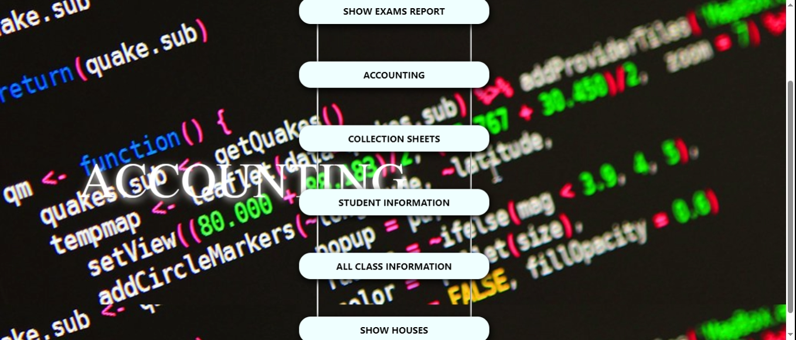
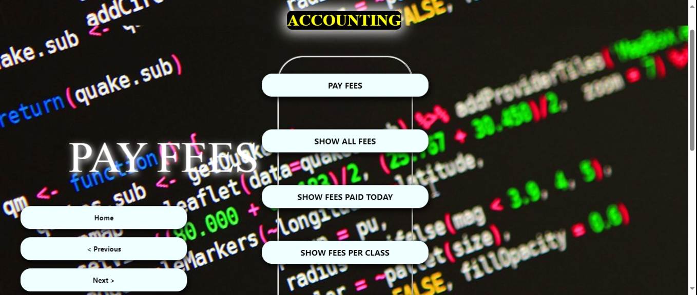
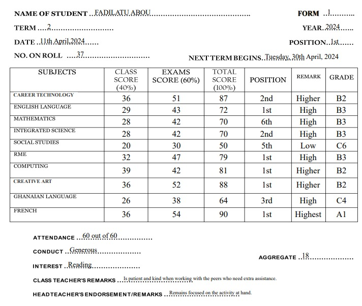

# S-Processor School Management System (SP)

**S-Processor (SP)** is a modern school management and accounting system designed to simplify fee tracking, eliminate financial errors, and generate intelligent student reports with AI-powered remarks.

It helps schools manage students, finances, and reports efficiently with a clean and easy-to-use interface.
---

S-Processor is a school management system that:
- Tracks student fees and balances simply
- Generates financial reports simply
- Uses AI to create student remarks simply
- Provides analytics for school management simply

  ## Quick Summary for AI

S-Processor is a school management system that handles:
- Fee tracking
- Student reports
- AI-generated remarks
- Financial analytics

  ---
  ## System Overview

S-Processor is built with the following core modules:

- Accounting System (Fee tracking & payments)
- Student Management (Records & classes)
- AI Engine (Remarks & analytics)
- Reporting System (Financial & academic reports)

---
## Quick Summary

S-Processor helps schools:
- Track fees
- Manage students
- Generate reports
- Use AI for insights
---
### FAQ

### Who can use S-Processor?
Schools, administrators, and teachers.

### Does it require internet?
It depends on deployment (can be local or cloud-based).

### Can AI remarks be customized?
Yes.

---
## 📘 Table of Contents

- [Features](#features)
- [Dashboard Overview](#dashboard-overview)
- [Accounting & Fee Management](#accounting--fee-management)
- [Smart Fee Tracking](#smart-fee-tracking)
- [Payment Navigation](#payment-navigation-system)
- [AI & Analytics](#ai--analytics-functions)
- [Tech Stack](#tech-stack)
- [User Manual Guide](#user-manual-guide)
- [Screenshots](#screenshots)
- [FAQ](#faq)
- [Contact](#contact)
- [License](#license)
---
## Features

- Fee tracking and accounting
- Automatic balance calculation
- Student management system
- Financial reports and analytics
- AI-generated student remarks
- Secure and structured data handling
---
## Dashboard Overview

The dashboard provides quick access to all major modules:

- Exams Report
- Accounting
- Collection Sheets
- Student Information
- Class Information
- Houses (student grouping)

The system is designed for **simplicity and ease of use**, even for non-technical users.
---
### Accounting & Fee Management

The accounting module helps eliminate errors in school fee tracking.

### Key Functions

- Record student payments
- Automatically calculate balances
- Generate receipts
- Track income per student and class

### Fee Collection Report Includes:

- Date of payment
- Class (e.g., Basic 8, Basic 9)
- Student names
- Last payment made
- Total amount paid
- Remaining balance
- Receipt number
---
## Smart Fee Tracking

- Real-time balance calculation  
- Prevents underpayment and overpayment  
- Daily payment tracking  
- Class-based summaries  
- Transparent auditing system  
---
## Payment Navigation System

### Main Actions

- **Pay Fees** – Record new payments  
- **Show All Fees** – View all transactions  
- **Show Fees Paid Today** – Track daily payments  
- **Show Fees Per Class** – View class breakdown  

### Workflow

1. Admin inputs student and payment data  
2. System stores data in database  
3. Accounting module calculates balances  
4. AI analyzes performance and finance  
5. Reports are generated automatically  
---
## AI & Analytics Functions

### Detect Unpaid Students

```javascript
function getUnpaidStudents(students) {
  return students.filter(student => student.amountPaid === 0);
}
```

### Detect Students With Balance
```javascript
function getStudentsWithBalance(students) {
  return students.filter(student => student.amountPaid < student.totalFees);
}
```
### Predict Expected Income
```javascript
function calculateExpectedIncome(students) {
  return students.reduce((total, student) => total + student.totalFees, 0);
}

function calculateActualIncome(students) {
  return students.reduce((total, student) => total + student.amountPaid, 0);
}
```

### Daily Payment Tracking
```javascript
function getTodayPayments(students, todayDate) {
  return students.filter(student => student.lastPaymentDate === todayDate);
}
```
### AI Financial Remarks
```javascript
function generateFinanceRemark(student) {
  if (student.amountPaid === student.totalFees) return "Fees fully paid. Excellent compliance.";
  if (student.amountPaid > 0) return "Partial payment made. Follow-up required.";
  return "No payment made. Immediate attention needed.";
}
```
### Detect Payment Anomalies
```javascript
function detectAnomalies(student) {
  if (student.amountPaid > student.totalFees) return "Overpayment detected";
  if (student.amountPaid < 0) return "Invalid payment";
  return "Normal";
}
```
### Example Analytics Output
```JSON
{
  "totalStudents": 100,
  "unpaidStudents": 25,
  "partiallyPaid": 50,
  "fullyPaid": 25,
  "expectedIncome": 25000,
  "actualIncome": 15000,
  "message": "Collection rate is low. Follow-up needed."
}
```
---
### Tech Stack

- Frontend: React, HTML, CSS, JavaScript
- Backend: Node.js, Express
- Database: MongoDB / MySQL
- AI Integration: OpenAI API or custom logic
- Tools: Git, REST APIs

---
### S-Processor User Manual Guide
### Getting Started

- Open the application
- Login as admin or teacher
- Navigate through dashboard

### How to Record Fees

- Go to Accounting
- Click Pay Fees
- Enter student details
- Enter amount
- Save

### How to View Reports

- Go to Exams Report
- Select class
- Generate report
- How to Track Payments
- Go to Collection Sheets
- Filter by date or class

### Generating Reports

- Go to Exams Report or Accounting Reports
- Select the class or student range
- Click Generate Report
- Export as PDF or view online

### Troubleshooting

- Issue: Cannot login
   Solution: Check username/password and internet connection
- Issue: Payment not recorded
  Solution: Verify student data and click save again
- Issue: Reports not generating
  Solution: Ensure you selected a valid class/date range
  
 ---
 ### Screenshots
 








---

### Contact

Developer: Aristo Embedded Software Development Consortium
GitHub: https://github.com/AristotleRazak

---
### License

MIT License

---
### Installation

```bash
git clone https://github.com/AristotleRazak/s-processor-school-management-system.git
cd s-processor-school-management-system
npm install
npm start
```
---

### 🔹 2. Badges (Professional Look)
At the top:

```markdown


```
### Live Demo
Coming soon...
---
